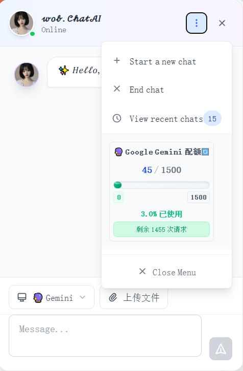
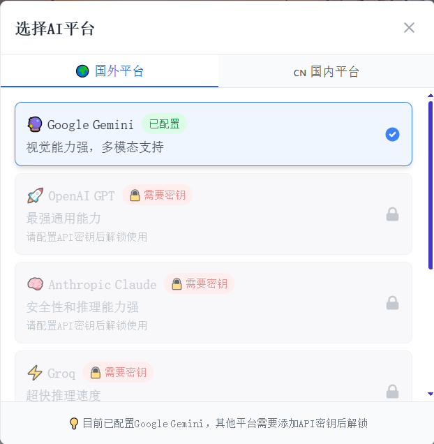
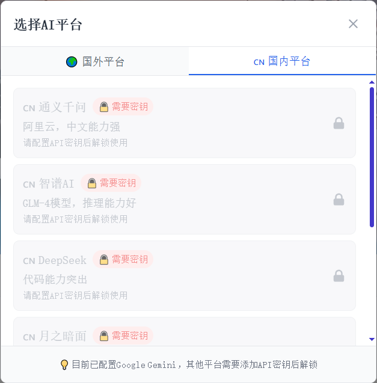

# FloChatAI - 悬浮智能聊天助手

<div align="center">


<div align="center">
<a href="README.md"><b>中文</b></a> | <a href="README_EN.md"><b>English</b></a>
</div>

一个基于 Cloudflare Workers 的现代化智能聊天助手，支持多种 AI 模型、文件上传、URL 解析等功能。


[](https://opensource.org/licenses/MIT)
[](https://nodejs.org/)
[](https://workers.cloudflare.com/)
</div>

## ✨ 特性

- 🤖 **13个 AI 平台支持**: 国外平台(OpenAI GPT、Anthropic Claude、Google Gemini等) + 国内平台(通义千问、智谱AI、DeepSeek等)
- 📝 **Markdown 语法**: 完整支持 Markdown 渲染，包括 GFM 扩展语法
- 🎨 **代码高亮**: 支持多种编程语言的语法高亮和代码复制
- 📁 **文件上传**: 支持图片、文档等多种文件格式，拖拽上传
- 🔗 **URL 解析**: 智能解析网页内容和元数据
- 💬 **实时聊天**: 流式响应，打字效果，上下文记忆
- 📚 **聊天历史**: 本地和云端同步，搜索功能
- 🔄 **多密钥轮换**: 自动API密钥轮换和负载均衡
- ⚡ **智能选择**: 根据内容类型自动选择最适合的AI平台
- 📱 **响应式设计**: 完美适配桌面和移动设备
- 🎯 **悬浮组件**: 优雅的右下角入口，类似ChatbaseAI
- ⌨️ **快捷键支持**: Ctrl+Enter发送，提升操作效率
- 📊 **配额管理**: 智能的 API 使用量控制和监控
- 🔒 **安全可靠**: 基于 Cloudflare Workers 的边缘计算

## 🎨 界面展示

<div align="center">
  <table>
    <tr>
      <td align="center" width="50%">
        <br>
        <b>主界面</b>
      </td>
      <td align="center" width="50%">
        <br>
        <b>菜单栏</b>
      </td>
    </tr>
    <tr>
      <td align="center" width="50%">
        <br>
        <b>国外AI平台</b>
      </td>
      <td align="center" width="50%">
        <br>
        <b>国内AI平台</b>
      </td>
    </tr>
  </table>
</div>

## 📁 项目结构

```
FloChatAI/
├── components/              # React 组件
│   ├── ChatAI.js           # 主聊天组件
│   ├── ChatAIWidget.js     # 悬浮聊天组件
│   ├── ChatHeader.js       # 聊天头部
│   ├── ChatMessages.js     # 消息列表
│   ├── ChatInput.js        # 输入框
│   ├── MessageBubble.js    # 消息气泡
│   ├── AIProviderSelector.js # AI平台选择器
│   ├── QuotaStatus.js      # 配额状态
│   ├── TypingIndicator.js  # 输入指示器
│   ├── ChatHistory.js      # 聊天历史
│   ├── ChatMenu.js         # 聊天菜单
│   ├── LazyImage.js        # 图片懒加载
│   ├── Loading.js          # 加载组件
│   ├── ResourceLoader.js   # 资源加载器
│   └── hooks/              # 自定义 Hooks
├── chatai-workers/         # Cloudflare Workers
│   ├── src/                # 源代码
│   │   ├── index.js        # 入口文件
│   │   ├── handlers/       # 请求处理器
│   │   └── services/       # 服务层
│   └── wrangler.toml       # Workers 配置
├── public/                 # 静态资源
│   ├── chatai-avatar.png   # AI 头像
│   ├── default-chatai.png  # 默认 AI 头像
│   ├── user.png           # 用户头像
│   └── img/               # 项目图片
└── README.md              # 项目文档
```

## 🏗️ 技术架构

### 架构概览

```
┌─────────────────┐    ┌─────────────────┐    ┌─────────────────┐
│   前端组件      │    │  Cloudflare     │    │   AI 服务商     │
│   React + Next  │◄──►│   Workers       │◄──►│ 13个AI平台     │
│   Framer Motion │    │   边缘计算      │    │ 多密钥轮换     │
└─────────────────┘    └─────────────────┘    └─────────────────┘
                              │
                              ▼
                    ┌─────────────────┐
                    │   存储服务      │
                    │  KV + R2 + DO   │
                    │  聊天+文件+实时 │
                    └─────────────────┘
```

### 前端技术栈

| 技术 | 版本 | 用途 |
|------|------|------|
| **React** | 18.2+ | 核心UI框架，现代React特性 |
| **Next.js** | 14.0+ | 全栈框架，SSR/SSG支持 |
| **Framer Motion** | 10.16+ | 流畅动画效果，交互体验 |
| **React Markdown** | 9.0+ | Markdown渲染，支持GFM |
| **React Syntax Highlighter** | 15.5+ | 代码高亮，多语言支持 |
| **Tailwind CSS** | 3.0+ | 原子化CSS，响应式设计 |

### 后端技术栈

| 技术 | 用途 | 特点 |
|------|------|------|
| **Cloudflare Workers** | 边缘计算平台 | 全球分布，低延迟，无服务器 |
| **Hono** | Web框架 | 轻量级，高性能，TypeScript友好 |
| **KV Storage** | 键值存储 | 聊天历史，用户会话，配额管理 |
| **R2 Storage** | 对象存储 | 文件上传，图片存储，成本低 |
| **Durable Objects** | 状态管理 | 实时聊天，WebSocket连接 |

### AI平台集成

#### 🌍 国外平台 (7个)
- **OpenAI GPT**: GPT-4/3.5，通用能力最强
- **Anthropic Claude**: Claude-3，安全性突出
- **Google Gemini**: Gemini Pro，多模态能力
- **Groq**: 超快推理速度，免费额度
- **Mistral AI**: 欧洲开源模型
- **Cohere**: 企业级AI平台
- **Perplexity**: 搜索增强AI

#### 🇨🇳 国内平台 (6个)
- **通义千问**: 阿里云，中文优化
- **智谱AI**: GLM-4，多模态
- **DeepSeek**: 代码能力强
- **月之暗面**: Kimi，长文本
- **百度文心**: 文心一言
- **MiniMax**: 海螺AI

### 核心特性实现

#### 🔄 多密钥轮换系统
```javascript
// 自动密钥轮换和负载均衡
const providers = {
  openai: ['key1', 'key2', 'key3'],
  gemini: ['key1', 'key2'],
  // 支持每个平台多个密钥
}
```

#### ⚡ 智能AI选择
```javascript
// 根据内容类型自动选择最适合的AI
const smartSelection = {
  image: ['gemini', 'openai', 'qwen'],
  code: ['deepseek', 'openai', 'claude'],
  reasoning: ['claude', 'openai', 'zhipu'],
  chat: ['gemini', 'qwen', 'moonshot']
}
```

#### 📝 Markdown渲染引擎
```javascript
// 完整的Markdown支持
<ReactMarkdown
  remarkPlugins={[remarkGfm]}
  components={{
    code: SyntaxHighlighter, // 代码高亮
    table: CustomTable,     // 表格样式
    link: ExternalLink      // 链接处理
  }}
/>
```

#### 🗄️ 数据存储架构
```javascript
// 分层存储策略
const storage = {
  KV: {
    'chat:${chatId}': '聊天记录',
    'session:${sessionId}': '用户会话',
    'quota:${provider}': '配额状态'
  },
  R2: {
    'files/${fileId}': '用户上传文件',
    'cache/${urlHash}': 'URL解析缓存'
  }
}
```

### 安全架构

#### 🔒 API密钥管理
- **Wrangler Secrets**: 安全存储API密钥
- **环境隔离**: 开发/生产环境分离
- **密钥轮换**: 自动故障转移机制

#### 🛡️ 安全防护
- **CORS配置**: 跨域请求控制
- **速率限制**: 防止API滥用
- **输入验证**: XSS和注入攻击防护
- **会话管理**: 安全的用户会话

#### 🌐 边缘计算优势
- **全球分布**: 200+数据中心
- **低延迟**: 就近响应用户请求
- **高可用**: 99.9%+服务可用性
- **自动扩展**: 无需容量规划

## 🚀 快速开始

### 环境要求

- Node.js 18+
- npm 或 yarn
- Cloudflare 账户

### 安装步骤

1. **克隆项目**
```bash
git clone https://github.com/wob25/FloChatAI.git
cd FloChatAI
```

2. **安装依赖**
```bash
# 安装前端依赖
npm install

# 安装 Workers 依赖
cd chatai-workers
npm install
```

3. **配置环境变量**
```bash
# 复制环境变量模板
cp .env.example .env.local

# 编辑环境变量
NEXT_PUBLIC_CHATAI_WORKER_URL=https://your-worker.your-subdomain.workers.dev
```

4. **配置和部署 Cloudflare Workers**

```bash
cd chatai-workers

# 步骤 1: 登录 Cloudflare
npx wrangler login

# 步骤 2: 创建 KV 命名空间（聊天数据存储）
npx wrangler kv:namespace create "CHAT_STORAGE"
npx wrangler kv:namespace create "CHAT_STORAGE" --preview
# 记录返回的 ID，更新 wrangler.toml 中的 id 和 preview_id

# 步骤 3: 创建 R2 存储桶（文件存储）
npx wrangler r2 bucket create your-bucket-name
# 更新 wrangler.toml 中的 bucket_name

# 步骤 4: 编辑 wrangler.toml 配置文件
# 将占位符替换为实际的 ID 和名称

# 步骤 5: 设置 API 密钥（选择需要的平台）
# 国外平台
echo "your-openai-key" | npx wrangler secret put OPENAI_API_KEYS
echo "your-anthropic-key" | npx wrangler secret put ANTHROPIC_API_KEYS
echo "your-gemini-key" | npx wrangler secret put GEMINI_API_KEYS

# 国内平台
echo "your-qwen-key" | npx wrangler secret put QWEN_API_KEYS
echo "your-zhipu-key" | npx wrangler secret put ZHIPU_API_KEYS
echo "your-deepseek-key" | npx wrangler secret put DEEPSEEK_API_KEYS

# 步骤 6: 部署到生产环境
npm run deploy
```

**配置步骤详解：**

1. **KV 命名空间**: 用于存储聊天历史和会话数据
2. **R2 存储桶**: 用于存储用户上传的文件
3. **API 密钥**: 支持多个密钥，用逗号分隔实现轮换
4. **环境配置**: 可以分别配置开发和生产环境

5. **启动开发服务器**
```bash
# 返回项目根目录
cd ..

# 启动前端开发服务器
npm run dev
```

## 📖 使用方法

### 🚀 快速集成（3分钟上手）

#### 步骤 1: 复制组件文件
将 `components` 文件夹复制到您的项目中：
```bash
# 复制所有组件文件到您的项目
cp -r FloChatAI/components ./src/components
```

#### 步骤 2: 安装依赖
```bash
npm install framer-motion react-markdown react-syntax-highlighter remark-gfm
```

#### 步骤 3: 在您的应用中使用
```jsx
// 在您的主页面或布局文件中（如 pages/_app.js 或 app/layout.js）
import ChatAIWidget from '@/components/ChatAIWidget'

export default function App({ Component, pageProps }) {
  return (
    <>
      {/* 您的页面内容 */}
      <Component {...pageProps} />

      {/* ChatAI 悬浮组件 - 会显示在右下角 */}
      <ChatAIWidget
        config={{
          name: '智能助手',
          avatar: '/default-chatai.png',
          welcomeMessage: '👋 您好！我是您的AI助手，有什么可以帮您的吗？',
          position: 'bottom-right',
          workerUrl: 'https://your-worker.your-subdomain.workers.dev'
        }}
      />
    </>
  )
}
```

### 🎯 不同框架的集成方式

#### Next.js 项目
```jsx
// pages/_app.js 或 app/layout.js
import ChatAIWidget from '@/components/ChatAIWidget'

export default function MyApp({ Component, pageProps }) {
  return (
    <>
      <Component {...pageProps} />
      <ChatAIWidget
        config={{
          name: '客服助手',
          workerUrl: process.env.NEXT_PUBLIC_CHATAI_WORKER_URL,
          welcomeMessage: '欢迎来到我们的网站！有什么问题可以问我哦～'
        }}
      />
    </>
  )
}
```

#### React 单页应用
```jsx
// src/App.js
import React from 'react'
import ChatAIWidget from './components/ChatAIWidget'

function App() {
  return (
    <div className="App">
      {/* 您的应用内容 */}
      <header>我的网站</header>
      <main>
        {/* 页面内容 */}
      </main>

      {/* ChatAI 组件 - 自动悬浮在右下角 */}
      <ChatAIWidget
        config={{
          name: '小助手',
          avatar: '/chatai-avatar.png',
          welcomeMessage: '🤖 我是AI助手，可以回答您的问题！',
          workerUrl: 'https://your-chatai-worker.workers.dev'
        }}
      />
    </div>
  )
}

export default App
```

#### Vue.js 项目集成
```vue
<!-- App.vue -->
<template>
  <div id="app">
    <!-- 您的应用内容 -->
    <router-view />

    <!-- ChatAI 组件 -->
    <ChatAIWidget :config="chatConfig" />
  </div>
</template>

<script>
import ChatAIWidget from './components/ChatAIWidget.vue'

export default {
  name: 'App',
  components: {
    ChatAIWidget
  },
  data() {
    return {
      chatConfig: {
        name: 'AI客服',
        avatar: '/default-chatai.png',
        welcomeMessage: '您好！我是智能客服，有什么可以帮您的？',
        workerUrl: process.env.VUE_APP_CHATAI_WORKER_URL
      }
    }
  }
}
</script>
```

### ⚙️ 详细配置选项

```javascript
const chatConfig = {
  // ================================
  // 基本设置
  // ================================
  name: '智能助手',                    // AI助手的名称
  avatar: '/default-chatai.png',       // AI头像路径
  welcomeMessage: '👋 您好！',         // 欢迎消息

  // ================================
  // 显示设置
  // ================================
  position: 'bottom-right',            // 位置: 'bottom-right' 或 'bottom-left'

  // ================================
  // 后端服务配置
  // ================================
  workerUrl: 'https://your-worker.workers.dev',  // 您的 Workers 服务地址

  // ================================
  // 主题自定义（可选）
  // ================================
  theme: {
    primaryColor: '#3B82F6',           // 主色调
    backgroundColor: '#FFFFFF',        // 背景色
    textColor: '#1F2937',             // 文字颜色
    borderRadius: '12px',             // 圆角大小
    shadow: '0 10px 25px rgba(0,0,0,0.1)'  // 阴影效果
  },

  // ================================
  // 功能开关（可选）
  // ================================
  features: {
    fileUpload: true,                 // 是否启用文件上传
    urlParsing: true,                 // 是否启用URL解析
    chatHistory: true,                // 是否启用聊天历史
    providerSelection: true           // 是否显示AI平台选择
  }
}
```

### 🎨 样式自定义

#### 自定义CSS样式
```css
/* 在您的全局CSS文件中添加 */

/* 自定义悬浮按钮样式 */
.chatai-widget-button {
  background: linear-gradient(135deg, #667eea 0%, #764ba2 100%);
  box-shadow: 0 8px 32px rgba(102, 126, 234, 0.3);
}

/* 自定义聊天窗口样式 */
.chatai-widget-window {
  border-radius: 16px;
  backdrop-filter: blur(10px);
  background: rgba(255, 255, 255, 0.95);
}

/* 自定义消息气泡样式 */
.chatai-message-ai {
  background: linear-gradient(135deg, #f093fb 0%, #f5576c 100%);
  color: white;
}
```

### 🔧 环境变量配置

创建 `.env.local` 文件：
```bash
# ChatAI 配置
NEXT_PUBLIC_CHATAI_WORKER_URL=https://your-worker.your-subdomain.workers.dev
NEXT_PUBLIC_CHATAI_NAME=智能助手
NEXT_PUBLIC_CHATAI_POSITION=bottom-right
```

在代码中使用：
```jsx
<ChatAIWidget
  config={{
    name: process.env.NEXT_PUBLIC_CHATAI_NAME || '智能助手',
    workerUrl: process.env.NEXT_PUBLIC_CHATAI_WORKER_URL,
    position: process.env.NEXT_PUBLIC_CHATAI_POSITION || 'bottom-right'
  }}
/>
```

### 📱 实际使用场景

#### 1. 客服网站集成
```jsx
// 电商网站客服
<ChatAIWidget
  config={{
    name: '购物助手',
    avatar: '/customer-service-avatar.png',
    welcomeMessage: '🛍️ 欢迎来到我们的商店！我可以帮您找到想要的商品，解答购物问题。',
    workerUrl: process.env.NEXT_PUBLIC_CHATAI_WORKER_URL,
    theme: {
      primaryColor: '#10B981',  // 绿色主题
      backgroundColor: '#F0FDF4'
    }
  }}
/>
```

#### 2. 技术文档网站
```jsx
// 开发者文档助手
<ChatAIWidget
  config={{
    name: '文档助手',
    avatar: '/dev-assistant-avatar.png',
    welcomeMessage: '💻 我是您的编程助手！可以帮您解答代码问题、API使用方法等。',
    workerUrl: process.env.NEXT_PUBLIC_CHATAI_WORKER_URL,
    theme: {
      primaryColor: '#6366F1',  // 紫色主题
      backgroundColor: '#F8FAFC'
    }
  }}
/>
```

#### 3. 教育平台
```jsx
// 学习助手
<ChatAIWidget
  config={{
    name: '学习伙伴',
    avatar: '/teacher-avatar.png',
    welcomeMessage: '📚 我是您的学习助手！可以帮您解答学习问题、提供学习建议。',
    workerUrl: process.env.NEXT_PUBLIC_CHATAI_WORKER_URL,
    features: {
      fileUpload: true,        // 支持上传作业文件
      urlParsing: true,        // 支持分析学习资料链接
      chatHistory: true        // 保存学习记录
    }
  }}
/>
```

### 🔧 常见问题解决

#### Q1: 组件不显示怎么办？
```jsx
// 检查这些常见问题：
// 1. 确保 workerUrl 配置正确
// 2. 检查 CSS 样式是否被覆盖
// 3. 确认组件路径正确

// 调试版本：
<ChatAIWidget
  config={{
    name: '测试助手',
    workerUrl: 'https://your-worker.workers.dev',
    // 添加调试信息
    debug: true
  }}
/>
```

#### Q2: 如何自定义样式？
```css
/* 方法1: 使用CSS变量 */
:root {
  --chatai-primary-color: #your-color;
  --chatai-background-color: #your-bg-color;
}

/* 方法2: 直接覆盖样式 */
.chatai-widget {
  /* 您的自定义样式 */
}
```

#### Q3: 如何处理多语言？
```jsx
// 多语言配置示例
const getConfig = (language) => ({
  name: language === 'zh' ? '智能助手' : 'AI Assistant',
  welcomeMessage: language === 'zh'
    ? '👋 您好！有什么可以帮您的吗？'
    : '👋 Hello! How can I help you?',
  workerUrl: process.env.NEXT_PUBLIC_CHATAI_WORKER_URL
})

// 使用
<ChatAIWidget config={getConfig(currentLanguage)} />
```

### ⚡ 性能优化建议

#### 1. 懒加载组件
```jsx
import { lazy, Suspense } from 'react'

// 懒加载 ChatAI 组件
const ChatAIWidget = lazy(() => import('@/components/ChatAIWidget'))

function App() {
  return (
    <div>
      {/* 您的应用内容 */}

      <Suspense fallback={<div>Loading...</div>}>
        <ChatAIWidget config={chatConfig} />
      </Suspense>
    </div>
  )
}
```

#### 2. 条件渲染
```jsx
// 只在需要时显示 ChatAI
function App() {
  const [showChat, setShowChat] = useState(false)

  useEffect(() => {
    // 页面加载完成后再显示聊天组件
    const timer = setTimeout(() => setShowChat(true), 2000)
    return () => clearTimeout(timer)
  }, [])

  return (
    <div>
      {/* 您的应用内容 */}

      {showChat && <ChatAIWidget config={chatConfig} />}
    </div>
  )
}
```

### 🎯 下一步

集成完成后，您可以：
1. 📊 查看 [配置选项](#配置选项) 了解更多自定义选项
2. 🚀 阅读 [部署指南](MD_File/DEPLOYMENT_GUIDE.md) 部署后端服务
3. 🔧 参考 [API 文档](chatai-workers/README.md) 了解后端接口
4. 💡 查看 [示例项目](example.jsx) 获取更多灵感

## 🛠️ 配置选项

### 环境变量

| 变量名 | 描述 | 默认值 |
|--------|------|--------|
| `NEXT_PUBLIC_CHATAI_WORKER_URL` | Workers 服务地址 | - |
| `CHATAI_ENABLE` | 是否启用 ChatAI | `true` |
| `CHATAI_NAME` | AI 助手名称 | `your-AI-name` |
| `CHATAI_POSITION` | 显示位置 | `bottom-right` |

### Workers 配置

在 `chatai-workers/wrangler.toml` 中配置：

```toml
# ================================
# 基本配置
# ================================
name = "chatai-workers"                    # Workers 项目名称，部署后的 URL 前缀
main = "src/index.js"                      # 入口文件路径
compatibility_date = "2024-01-01"         # Cloudflare Workers 兼容性日期

# ================================
# 环境变量配置
# ================================
[vars]
ENVIRONMENT = "production"                 # 运行环境：development/production
MAX_FILE_SIZE = 10485760                  # 文件上传大小限制（10MB，单位：字节）
ALLOWED_ORIGINS = "https://your-domain.com"  # 允许的跨域来源，多个用逗号分隔

# ================================
# KV 存储配置（聊天数据存储）
# ================================
[[kv_namespaces]]
binding = "CHAT_STORAGE"                   # 代码中的绑定名称
id = "your-kv-namespace-id"               # KV 命名空间 ID（需要创建后填入）
preview_id = "your-kv-namespace-id"       # 预览环境的 KV 命名空间 ID

# ================================
# R2 存储配置（文件存储）
# ================================
[[r2_buckets]]
binding = "FILE_STORAGE"                   # 代码中的绑定名称
bucket_name = "your-r2-bucket-name"       # R2 存储桶名称（需要创建后填入）
preview_bucket_name = "your-r2-bucket-name"  # 预览环境的存储桶名称

# ================================
# 生产环境配置
# ================================
[env.production]
name = "chatai-workers-prod"              # 生产环境项目名称

[env.production.vars]
ENVIRONMENT = "production"                 # 生产环境标识
MAX_FILE_SIZE = 10485760                  # 生产环境文件大小限制
ALLOWED_ORIGINS = "https://your-production-domain.com"  # 生产环境允许的域名

# 生产环境 KV 存储
[[env.production.kv_namespaces]]
binding = "CHAT_STORAGE"
id = "your-production-kv-namespace-id"    # 生产环境 KV ID
preview_id = "your-production-kv-namespace-id"

# 生产环境 R2 存储
[[env.production.r2_buckets]]
binding = "FILE_STORAGE"
bucket_name = "your-production-r2-bucket-name"    # 生产环境存储桶
preview_bucket_name = "your-production-r2-bucket-name"
```

#### 配置说明：

**基本配置：**
- `name`: Workers 项目名称，影响部署后的 URL
- `main`: 指定入口文件，通常是 `src/index.js`
- `compatibility_date`: 确保使用特定版本的 Workers 运行时

**环境变量：**
- `ENVIRONMENT`: 区分开发/生产环境
- `MAX_FILE_SIZE`: 限制上传文件大小，防止滥用
- `ALLOWED_ORIGINS`: CORS 安全配置，限制访问来源

**存储配置：**
- `KV 存储`: 用于保存聊天历史和会话数据
- `R2 存储`: 用于保存用户上传的文件

**重要提醒：**
- 所有 `your-*` 占位符需要替换为实际值
- KV 和 R2 资源需要先在 Cloudflare 控制台创建
- API 密钥通过 `wrangler secret put` 命令单独设置

## 🔧 开发指南

### 本地开发

```bash
# 启动 Workers 开发服务器
cd chatai-workers
npm run dev

# 启动前端开发服务器（新终端）
cd ..
npm run dev
```

### 测试

```bash
# 运行 Workers 测试
cd chatai-workers
npm test

# 运行前端测试
cd ..
npm test
```

### 部署

```bash
# 部署到 Cloudflare Workers
cd chatai-workers
npm run deploy

# 构建前端
cd ..
npm run build
```

## 📊 Star History

[](https://www.star-history.com/#wob25/FloChatAI&Date)

## 🤝 贡献

欢迎提交 Issue 和 Pull Request！

1. Fork 项目
2. 创建特性分支 (`git checkout -b feature/AmazingFeature`)
3. 提交更改 (`git commit -m 'Add some AmazingFeature'`)
4. 推送到分支 (`git push origin feature/AmazingFeature`)
5. 打开 Pull Request

## 📄 许可证

本项目基于 MIT 许可证开源 - 查看 [LICENSE](LICENSE) 文件了解详情。

## 👨‍💻 作者

**wob** - [GitHub](https://github.com/wob25)

## 🙏 致谢

- [Cloudflare Workers](https://workers.cloudflare.com/) - 边缘计算平台
- [Google](https://ai.google.dev/) - Gemini 模型
- [Framer Motion](https://www.framer.com/motion/) - 动画库

---

<div align="center">
Made with ❤️ by wob
</div>
