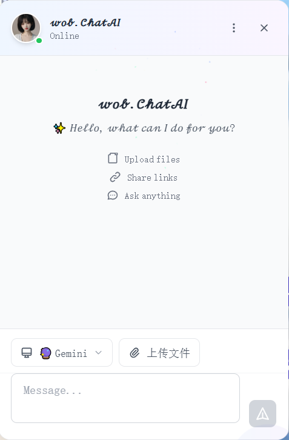
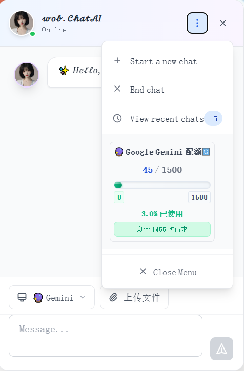

# FloChatAI - Floating AI Chat Assistant

<div align="center">


<div align="center">
<a href="README.md"><b>中文</b></a> | <a href="README_EN.md"><b>English</b></a>
</div>

A modern intelligent chat assistant based on Cloudflare Workers, supporting multiple AI models, file uploads, URL parsing, and more.


[](https://opensource.org/licenses/MIT)
[](https://nodejs.org/)
[](https://workers.cloudflare.com/)
</div>

## ✨ Features

- 🤖 **13 AI Platform Support**: International platforms (OpenAI GPT, Anthropic Claude, Google Gemini, etc.) + Chinese platforms (Qwen, Zhipu AI, DeepSeek, etc.)
- 📝 **Markdown Syntax**: Full Markdown rendering support including GFM extensions
- 🎨 **Code Highlighting**: Multi-language syntax highlighting with code copy functionality
- 📁 **File Upload**: Support for images, documents, and drag-and-drop upload
- 🔗 **URL Parsing**: Intelligent web content and metadata extraction
- 💬 **Real-time Chat**: Streaming responses, typing effects, context memory
- 📚 **Chat History**: Local and cloud sync with search functionality
- 🔄 **Multi-key Rotation**: Automatic API key rotation and load balancing
- ⚡ **Smart Selection**: Auto-select optimal AI platform based on content type
- 📱 **Responsive Design**: Perfect adaptation for desktop and mobile devices
- 🎯 **Floating Widget**: Elegant bottom-right entry, similar to ChatbaseAI
- ⌨️ **Keyboard Shortcuts**: Ctrl+Enter to send, improved operation efficiency
- 📊 **Quota Management**: Intelligent API usage control and monitoring
- 🔒 **Secure & Reliable**: Based on Cloudflare Workers edge computing

## 🎨 Interface Preview

<div align="center">
  <table>
    <tr>
      <td align="center" width="50%">
        <br>
        <b>Main Interface</b>
      </td>
      <td align="center" width="50%">
        <br>
        <b>Menu Bar</b>
      </td>
    </tr>
    <tr>
      <td align="center" width="50%">
        <br>
        <b>International AI Platforms</b>
      </td>
      <td align="center" width="50%">
        <br>
        <b>Chinese AI Platforms</b>
      </td>
    </tr>
  </table>
</div>

## 📁 Project Structure

```
FloChatAI/
├── components/              # React Components
│   ├── ChatAI.js           # Main chat component
│   ├── ChatAIWidget.js     # Floating chat widget
│   ├── ChatHeader.js       # Chat header
│   ├── ChatMessages.js     # Message list
│   ├── ChatInput.js        # Input box
│   ├── MessageBubble.js    # Message bubble
│   ├── AIProviderSelector.js # AI platform selector
│   ├── QuotaStatus.js      # Quota status
│   ├── TypingIndicator.js  # Typing indicator
│   ├── ChatHistory.js      # Chat history
│   ├── ChatMenu.js         # Chat menu
│   ├── LazyImage.js        # Image lazy loading
│   ├── Loading.js          # Loading component
│   ├── ResourceLoader.js   # Resource loader
│   └── hooks/              # Custom Hooks
├── chatai-workers/         # Cloudflare Workers
│   ├── src/                # Source code
│   │   ├── index.js        # Entry file
│   │   ├── handlers/       # Request handlers
│   │   └── services/       # Service layer
│   └── wrangler.toml       # Workers configuration
├── public/                 # Static assets
│   ├── chatai-avatar.png   # AI avatar
│   ├── default-chatai.png  # Default AI avatar
│   ├── user.png           # User avatar
│   └── img/               # Project images
└── README.md              # Project documentation
```

## 🏗️ Technical Architecture

### Architecture Overview

```
┌─────────────────┐    ┌─────────────────┐    ┌─────────────────┐
│   Frontend      │    │  Cloudflare     │    │   AI Providers  │
│   React + Next  │◄──►│   Workers       │◄──►│ 13 AI Platforms │
│   Framer Motion │    │   Edge Computing│    │ Multi-key Rotation│
└─────────────────┘    └─────────────────┘    └─────────────────┘
                              │
                              ▼
                    ┌─────────────────┐
                    │   Storage       │
                    │  KV + R2 + DO   │
                    │  Chat+File+RT   │
                    └─────────────────┘
```

### Frontend Tech Stack

| Technology | Version | Purpose |
|------------|---------|---------|
| **React** | 18.2+ | Core UI framework with modern features |
| **Next.js** | 14.0+ | Full-stack framework with SSR/SSG |
| **Framer Motion** | 10.16+ | Smooth animations and interactions |
| **React Markdown** | 9.0+ | Markdown rendering with GFM support |
| **React Syntax Highlighter** | 15.5+ | Code highlighting for multiple languages |
| **Tailwind CSS** | 3.0+ | Atomic CSS with responsive design |

### Backend Tech Stack

| Technology | Purpose | Features |
|------------|---------|----------|
| **Cloudflare Workers** | Edge computing platform | Global distribution, low latency, serverless |
| **Hono** | Web framework | Lightweight, high performance, TypeScript friendly |
| **KV Storage** | Key-value store | Chat history, user sessions, quota management |
| **R2 Storage** | Object storage | File uploads, image storage, cost-effective |
| **Durable Objects** | State management | Real-time chat, WebSocket connections |

### AI Platform Integration

#### 🌍 International Platforms (7)
- **OpenAI GPT**: GPT-4/3.5, strongest general capability
- **Anthropic Claude**: Claude-3, outstanding safety
- **Google Gemini**: Gemini Pro, multimodal capabilities
- **Groq**: Ultra-fast inference, free tier
- **Mistral AI**: European open-source models
- **Cohere**: Enterprise AI platform
- **Perplexity**: Search-enhanced AI

#### 🇨🇳 Chinese Platforms (6)
- **Qwen**: Alibaba Cloud, Chinese optimized
- **Zhipu AI**: GLM-4, multimodal
- **DeepSeek**: Strong coding capabilities
- **Moonshot**: Kimi, long context
- **Baidu Wenxin**: ERNIE Bot
- **MiniMax**: Hailuo AI

### Core Feature Implementation

#### 🔄 Multi-key Rotation System
```javascript
// Automatic key rotation and load balancing
const providers = {
  openai: ['key1', 'key2', 'key3'],
  gemini: ['key1', 'key2'],
  // Support multiple keys per platform
}
```

#### ⚡ Smart AI Selection
```javascript
// Auto-select optimal AI based on content type
const smartSelection = {
  image: ['gemini', 'openai', 'qwen'],
  code: ['deepseek', 'openai', 'claude'],
  reasoning: ['claude', 'openai', 'zhipu'],
  chat: ['gemini', 'qwen', 'moonshot']
}
```

#### 📝 Markdown Rendering Engine
```javascript
// Complete Markdown support
<ReactMarkdown
  remarkPlugins={[remarkGfm]}
  components={{
    code: SyntaxHighlighter, // Code highlighting
    table: CustomTable,     // Table styling
    link: ExternalLink      // Link handling
  }}
/>
```

#### 🗄️ Data Storage Architecture
```javascript
// Layered storage strategy
const storage = {
  KV: {
    'chat:${chatId}': 'Chat records',
    'session:${sessionId}': 'User sessions',
    'quota:${provider}': 'Quota status'
  },
  R2: {
    'files/${fileId}': 'User uploaded files',
    'cache/${urlHash}': 'URL parsing cache'
  }
}
```

### Security Architecture

#### 🔒 API Key Management
- **Wrangler Secrets**: Secure API key storage
- **Environment Isolation**: Dev/prod separation
- **Key Rotation**: Automatic failover mechanism

#### 🛡️ Security Protection
- **CORS Configuration**: Cross-origin request control
- **Rate Limiting**: Prevent API abuse
- **Input Validation**: XSS and injection protection
- **Session Management**: Secure user sessions

#### 🌐 Edge Computing Advantages
- **Global Distribution**: 200+ data centers
- **Low Latency**: Respond near users
- **High Availability**: 99.9%+ uptime
- **Auto Scaling**: No capacity planning needed

## 🚀 Quick Start

### Requirements

- Node.js 18+
- npm or yarn
- Cloudflare account

### Installation Steps

1. **Clone Project**
```bash
git clone https://github.com/wob25/FloChatAI.git
cd FloChatAI
```

2. **Install Dependencies**
```bash
# Install frontend dependencies
npm install

# Install Workers dependencies
cd chatai-workers
npm install
```

3. **Configure Environment Variables**
```bash
# Copy environment template
cp .env.example .env.local

# Edit environment variables
NEXT_PUBLIC_CHATAI_WORKER_URL=https://your-worker.your-subdomain.workers.dev
```

4. **Configure and Deploy Cloudflare Workers**

```bash
cd chatai-workers

# Step 1: Login to Cloudflare
npx wrangler login

# Step 2: Create KV namespace (chat data storage)
npx wrangler kv:namespace create "CHAT_STORAGE"
npx wrangler kv:namespace create "CHAT_STORAGE" --preview
# Record the returned IDs, update id and preview_id in wrangler.toml

# Step 3: Create R2 bucket (file storage)
npx wrangler r2 bucket create your-bucket-name
# Update bucket_name in wrangler.toml

# Step 4: Edit wrangler.toml configuration file
# Replace placeholders with actual IDs and names

# Step 5: Set API keys (choose platforms you need)
# International platforms
echo "your-openai-key" | npx wrangler secret put OPENAI_API_KEYS
echo "your-anthropic-key" | npx wrangler secret put ANTHROPIC_API_KEYS  
echo "your-gemini-key" | npx wrangler secret put GEMINI_API_KEYS

# Chinese platforms
echo "your-qwen-key" | npx wrangler secret put QWEN_API_KEYS
echo "your-zhipu-key" | npx wrangler secret put ZHIPU_API_KEYS
echo "your-deepseek-key" | npx wrangler secret put DEEPSEEK_API_KEYS

# Step 6: Deploy to production
npm run deploy
```

**Configuration Steps Explained:**

1. **KV Namespace**: Used to store chat history and session data
2. **R2 Bucket**: Used to store user uploaded files
3. **API Keys**: Support multiple keys, comma-separated for rotation
4. **Environment Configuration**: Separate dev and production environments

5. **Start Frontend**
```bash
# Return to project root
cd ..

# Start development server
npm run dev
```

### Workers Configuration

Configure in `chatai-workers/wrangler.toml`:

```toml
# ================================
# Basic Configuration
# ================================
name = "chatai-workers"                    # Workers project name, URL prefix after deployment
main = "src/index.js"                      # Entry file path
compatibility_date = "2024-01-01"         # Cloudflare Workers compatibility date

# ================================
# Environment Variables
# ================================
[vars]
ENVIRONMENT = "production"                 # Runtime environment: development/production
MAX_FILE_SIZE = 10485760                  # File upload size limit (10MB, in bytes)
ALLOWED_ORIGINS = "https://your-domain.com"  # Allowed CORS origins, comma-separated

# ================================
# KV Storage Configuration (Chat Data Storage)
# ================================
[[kv_namespaces]]
binding = "CHAT_STORAGE"                   # Binding name in code
id = "your-kv-namespace-id"               # KV namespace ID (fill after creation)
preview_id = "your-kv-namespace-id"       # Preview environment KV namespace ID

# ================================
# R2 Storage Configuration (File Storage)
# ================================
[[r2_buckets]]
binding = "FILE_STORAGE"                   # Binding name in code
bucket_name = "your-r2-bucket-name"       # R2 bucket name (fill after creation)
preview_bucket_name = "your-r2-bucket-name"  # Preview environment bucket name

# ================================
# Production Environment Configuration
# ================================
[env.production]
name = "chatai-workers-prod"              # Production environment project name

[env.production.vars]
ENVIRONMENT = "production"                 # Production environment identifier
MAX_FILE_SIZE = 10485760                  # Production environment file size limit
ALLOWED_ORIGINS = "https://your-production-domain.com"  # Production environment allowed domains

# Production environment KV storage
[[env.production.kv_namespaces]]
binding = "CHAT_STORAGE"
id = "your-production-kv-namespace-id"    # Production environment KV ID
preview_id = "your-production-kv-namespace-id"

# Production environment R2 storage
[[env.production.r2_buckets]]
binding = "FILE_STORAGE"
bucket_name = "your-production-r2-bucket-name"    # Production environment bucket
preview_bucket_name = "your-production-r2-bucket-name"
```

#### Configuration Explanation:

**Basic Configuration:**
- `name`: Workers project name, affects deployment URL
- `main`: Specifies entry file, usually `src/index.js`
- `compatibility_date`: Ensures specific Workers runtime version

**Environment Variables:**
- `ENVIRONMENT`: Distinguish dev/production environments
- `MAX_FILE_SIZE`: Limit upload file size to prevent abuse
- `ALLOWED_ORIGINS`: CORS security configuration, restrict access sources

**Storage Configuration:**
- `KV Storage`: Used to save chat history and session data
- `R2 Storage`: Used to save user uploaded files

**Important Reminders:**
- All `your-*` placeholders need to be replaced with actual values
- KV and R2 resources need to be created in Cloudflare console first
- API keys are set separately via `wrangler secret put` command

## 📖 Usage

### 🚀 Quick Integration (3 minutes setup)

#### Step 1: Copy component files
Copy the `components` folder to your project:
```bash
# Copy all component files to your project
cp -r FloChatAI/components ./src/components
```

#### Step 2: Install dependencies
```bash
npm install framer-motion react-markdown react-syntax-highlighter remark-gfm
```

#### Step 3: Use in your application
```jsx
// In your main page or layout file (e.g., pages/_app.js or app/layout.js)
import ChatAIWidget from '@/components/ChatAIWidget'

export default function App({ Component, pageProps }) {
  return (
    <>
      {/* Your page content */}
      <Component {...pageProps} />

      {/* ChatAI floating component - displays in bottom-right corner */}
      <ChatAIWidget
        config={{
          name: 'AI Assistant',
          avatar: '/default-chatai.png',
          welcomeMessage: '👋 Hello! I am your AI assistant. How can I help you?',
          position: 'bottom-right',
          workerUrl: 'https://your-worker.your-subdomain.workers.dev'
        }}
      />
    </>
  )
}
```

### 🎯 Framework Integration

#### Next.js Project
```jsx
// pages/_app.js or app/layout.js
import ChatAIWidget from '@/components/ChatAIWidget'

export default function MyApp({ Component, pageProps }) {
  return (
    <>
      <Component {...pageProps} />
      <ChatAIWidget
        config={{
          name: 'Customer Service',
          workerUrl: process.env.NEXT_PUBLIC_CHATAI_WORKER_URL,
          welcomeMessage: 'Welcome to our website! Feel free to ask me anything~'
        }}
      />
    </>
  )
}
```

#### React Single Page Application
```jsx
// src/App.js
import React from 'react'
import ChatAIWidget from './components/ChatAIWidget'

function App() {
  return (
    <div className="App">
      {/* Your application content */}
      <header>My Website</header>
      <main>
        {/* Page content */}
      </main>

      {/* ChatAI component - automatically floats in bottom-right corner */}
      <ChatAIWidget
        config={{
          name: 'Assistant',
          avatar: '/chatai-avatar.png',
          welcomeMessage: '🤖 I am an AI assistant, I can answer your questions!',
          workerUrl: 'https://your-chatai-worker.workers.dev'
        }}
      />
    </div>
  )
}

export default App
```

### ⚙️ Configuration Options

```javascript
const chatConfig = {
  // ================================
  // Basic Settings
  // ================================
  name: 'AI Assistant',                    // AI assistant name
  avatar: '/default-chatai.png',           // AI avatar path
  welcomeMessage: '👋 Hello!',             // Welcome message

  // ================================
  // Display Settings
  // ================================
  position: 'bottom-right',                // Position: 'bottom-right' or 'bottom-left'

  // ================================
  // Backend Service Configuration
  // ================================
  workerUrl: 'https://your-worker.workers.dev',  // Your Workers service URL

  // ================================
  // Theme Customization (Optional)
  // ================================
  theme: {
    primaryColor: '#3B82F6',               // Primary color
    backgroundColor: '#FFFFFF',            // Background color
    textColor: '#1F2937',                 // Text color
    borderRadius: '12px',                 // Border radius
    shadow: '0 10px 25px rgba(0,0,0,0.1)' // Shadow effect
  },

  // ================================
  // Feature Toggles (Optional)
  // ================================
  features: {
    fileUpload: true,                     // Enable file upload
    urlParsing: true,                     // Enable URL parsing
    chatHistory: true,                    // Enable chat history
    providerSelection: true               // Show AI platform selection
  }
}
```

### 📱 Real-world Use Cases

#### 1. E-commerce Customer Service
```jsx
// E-commerce website customer service
<ChatAIWidget
  config={{
    name: 'Shopping Assistant',
    avatar: '/customer-service-avatar.png',
    welcomeMessage: '🛍️ Welcome to our store! I can help you find products and answer shopping questions.',
    workerUrl: process.env.NEXT_PUBLIC_CHATAI_WORKER_URL,
    theme: {
      primaryColor: '#10B981',  // Green theme
      backgroundColor: '#F0FDF4'
    }
  }}
/>
```

#### 2. Technical Documentation Site
```jsx
// Developer documentation assistant
<ChatAIWidget
  config={{
    name: 'Documentation Assistant',
    avatar: '/dev-assistant-avatar.png',
    welcomeMessage: '💻 I am your programming assistant! I can help with code questions, API usage, etc.',
    workerUrl: process.env.NEXT_PUBLIC_CHATAI_WORKER_URL,
    theme: {
      primaryColor: '#6366F1',  // Purple theme
      backgroundColor: '#F8FAFC'
    }
  }}
/>
```

#### 3. Educational Platform
```jsx
// Learning assistant
<ChatAIWidget
  config={{
    name: 'Study Buddy',
    avatar: '/teacher-avatar.png',
    welcomeMessage: '📚 I am your learning assistant! I can help with study questions and provide learning advice.',
    workerUrl: process.env.NEXT_PUBLIC_CHATAI_WORKER_URL,
    features: {
      fileUpload: true,        // Support homework file uploads
      urlParsing: true,        // Support analyzing study material links
      chatHistory: true        // Save learning records
    }
  }}
/>
```

### 🔧 Environment Variables

Create `.env.local` file:
```bash
# ChatAI Configuration
NEXT_PUBLIC_CHATAI_WORKER_URL=https://your-worker.your-subdomain.workers.dev
NEXT_PUBLIC_CHATAI_NAME=AI Assistant
NEXT_PUBLIC_CHATAI_POSITION=bottom-right
```

Use in code:
```jsx
<ChatAIWidget
  config={{
    name: process.env.NEXT_PUBLIC_CHATAI_NAME || 'AI Assistant',
    workerUrl: process.env.NEXT_PUBLIC_CHATAI_WORKER_URL,
    position: process.env.NEXT_PUBLIC_CHATAI_POSITION || 'bottom-right'
  }}
/>
```

## 📊 Star History

[](https://www.star-history.com/#wob25/FloChatAI&Date)

## 🤝 Contributing

Welcome to submit Issues and Pull Requests!

1. Fork the project
2. Create feature branch (`git checkout -b feature/AmazingFeature`)
3. Commit changes (`git commit -m 'Add some AmazingFeature'`)
4. Push to branch (`git push origin feature/AmazingFeature`)
5. Open Pull Request

## 📄 License

This project is open source under the MIT License - see [LICENSE](LICENSE) file for details.

## 👨‍💻 Author

**wob** - [GitHub](https://github.com/wob25)

## 🙏 Acknowledgments

- [Cloudflare Workers](https://workers.cloudflare.com/) - Edge computing platform
- [OpenAI](https://openai.com/) - GPT models
- [Google](https://ai.google.dev/) - Gemini models
- [Framer Motion](https://www.framer.com/motion/) - Animation library

---

<div align="center">
Made with ❤️ by wob
</div>
